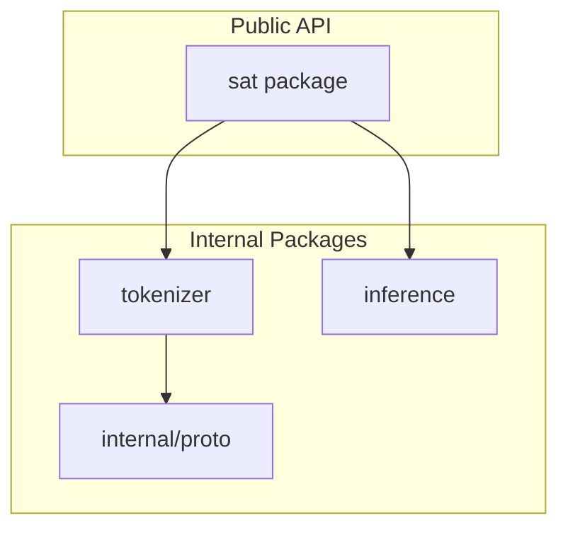
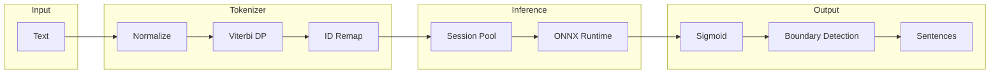
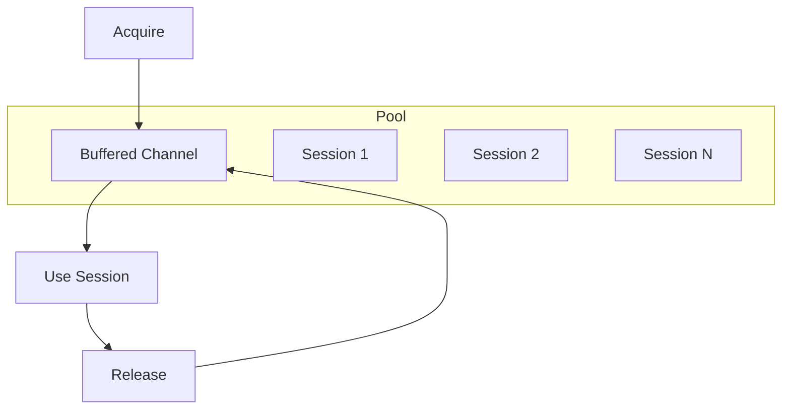

# Architecture

This document describes the internal architecture of go-sat.

## Package Structure



| Package | Responsibility |
|---------|----------------|
| `sat` | Public API: Segmenter, options, errors |
| `tokenizer` | SentencePiece Unigram tokenization |
| `inference` | ONNX Runtime session management |
| `internal/proto` | Generated protobuf for SentencePiece model format |

## Data Flow



### Processing Steps

1. **Normalize**: Collapse whitespace, add SentencePiece prefix (`▁`)
2. **Viterbi DP**: Find optimal tokenization using dynamic programming
3. **ID Remap**: Convert SentencePiece indices to HuggingFace XLM-RoBERTa IDs
4. **Session Pool**: Acquire ONNX session from pool
5. **ONNX Runtime**: Run inference, produce per-token logits
6. **Sigmoid**: Convert logits to probabilities
7. **Boundary Detection**: Mark positions where probability exceeds threshold
8. **Result**: Split text at boundary positions

## Tokenizer

The tokenizer implements SentencePiece Unigram algorithm compatible with XLM-RoBERTa.

### Token ID Mapping

SentencePiece and HuggingFace use different ID conventions. The tokenizer remaps IDs:

| Token | SentencePiece Index | HuggingFace ID |
|-------|---------------------|----------------|
| `<unk>` | 0 | 3 |
| `<s>` | 1 | 0 |
| `</s>` | 2 | 2 |
| `<pad>` | (not present) | 1 |
| Normal tokens | n (n >= 3) | n + 1 |

HuggingFace inserts `<pad>` at position 1 and shifts normal tokens by 1. This mapping ensures model outputs match Python implementations.

### Unigram Algorithm

```mermaid
flowchart TD
    START[Input: normalized text] --> INIT[Initialize DP arrays]
    INIT --> LOOP[For each position i]
    LOOP --> TRY[Try all tokens ending at i]
    TRY --> SCORE[Compute score: best[j] + log_prob[token]]
    SCORE --> UPDATE[Update best[i] if score improves]
    UPDATE --> NEXT{More positions?}
    NEXT -->|Yes| LOOP
    NEXT -->|No| BACK[Backtrack to recover tokens]
    BACK --> RESULT[Token sequence with offsets]
```

The Viterbi algorithm finds the tokenization with maximum probability:

1. `best[i]` = best log probability to tokenize characters 0 to i
2. `parent[i]` = start position of the token ending at i
3. For each position, try all vocabulary tokens that could end there
4. Select the tokenization with highest cumulative score
5. Backtrack from end to recover the optimal token sequence

### Text Normalization

Before tokenization, text undergoes normalization:

- Leading/trailing whitespace trimmed
- Consecutive whitespace collapsed to single space
- Spaces replaced with `▁` (U+2581)
- `▁` prepended to first character (word boundary convention)

Example: `"Hello  world"` becomes `"▁Hello▁world"`

## Inference

### Session Management



The session pool manages multiple ONNX Runtime sessions:

- Pre-creates `N` sessions at initialization (default: `runtime.NumCPU()`)
- Sessions stored in buffered channel
- `Acquire` blocks if no sessions available (respects context cancellation)
- `Release` returns session to pool

### ONNX Model Interface

**Inputs:**

| Name | Shape | Type | Description |
|------|-------|------|-------------|
| `input_ids` | [1, seq_len] | int64 | Token IDs |
| `attention_mask` | [1, seq_len] | int64 | Mask (1 for real tokens) |

**Outputs:**

| Name | Shape | Type | Description |
|------|-------|------|-------------|
| `logits` | [1, seq_len, 1] | float32 | Boundary probability logits |

**Post-processing:**

```
probability = sigmoid(logit) = 1 / (1 + exp(-logit))
is_boundary = probability > threshold
```

## Thread Safety

### Segmenter

`Segmenter` is safe for concurrent use:

- Tokenizer is read-only after initialization
- Session pool uses channel synchronization
- Individual sessions protected by mutex

Multiple goroutines can call `IsComplete` and `Segment` concurrently. The pool ensures at most `N` concurrent inferences (where `N` is pool size).

### Session Pool

```go
type Pool struct {
    sessions  chan *Session  // Buffered channel acts as semaphore
    modelPath string
    size      int
    mu        sync.Mutex     // Protects closed flag
    closed    bool
}
```

- Acquire: Receives from channel (blocks if empty)
- Release: Sends to channel
- Close: Sets flag, closes channel, drains remaining sessions

### Individual Session

```go
type Session struct {
    session *ort.DynamicAdvancedSession
    mu      sync.Mutex  // Protects session and closed flag
    closed  bool
}
```

Each session has its own mutex. While a session is held by one goroutine (acquired from pool), the mutex ensures ONNX Runtime calls are serialized.

## Error Handling

### Sentinel Errors

```go
var (
    ErrModelNotFound   = errors.New("sat: model file not found")
    ErrInvalidModel    = errors.New("sat: invalid model format")
    ErrTokenizerFailed = errors.New("sat: tokenizer initialization failed")
)
```

Callers can use `errors.Is` to handle specific conditions:

```go
if errors.Is(err, sat.ErrModelNotFound) {
    // Model file does not exist
}
```

### Error Wrapping

Internal errors are wrapped with context:

```go
return nil, fmt.Errorf("creating session %d: %w", i, err)
```

This preserves the original error while adding context for debugging.

### Context Cancellation

All inference methods accept `context.Context` and respect cancellation:

- `Pool.Acquire`: Returns `ctx.Err()` if context cancelled while waiting
- `Session.Infer`: Checks context before expensive operations

## Dependencies

| Dependency | Purpose |
|------------|---------|
| `github.com/yalue/onnxruntime_go` | ONNX Runtime Go bindings |
| `google.golang.org/protobuf` | SentencePiece model file parsing |

The library requires the ONNX Runtime shared library at runtime. No CGO is required directly; the onnxruntime_go package handles native library loading.
